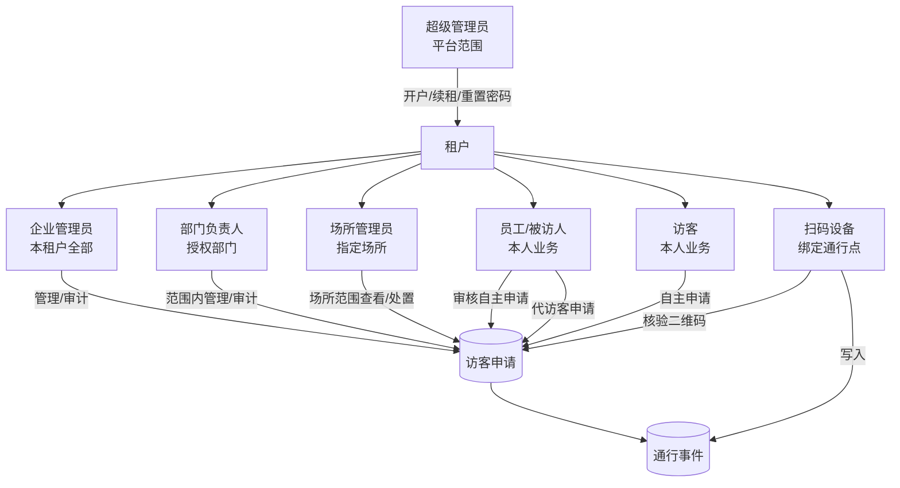

# 角色权限与职责

## 1. 角色关系图

> 员工/被访人与访客身份互斥。扫码设备不是人员角色；一期不设置门卫账号。

## 2. 数据范围

| 角色代码 | 角色 | 数据范围 | 服务端过滤规则 |
|---|---|---|---|
| `PLATFORM_ADMIN` | 超级管理员 | 全平台租户基础资料 | 仅平台接口；不得读取租户访客明细，除非另有审计授权 |
| `TENANT_ADMIN` | 企业管理员 | 当前租户全部 | `tenant_id = 当前租户` |
| `DEPT_MANAGER` | 部门负责人 | 授权部门；是否含下级部门需评审确认 | `tenant_id` + `department_id in scope` |
| `VENUE_MANAGER` | 场所管理员 | 多选指定场所 | `tenant_id` + `venue_id in scope` |
| `EMPLOYEE` | 员工/被访人 | 本人作为被访人或发起人的申请 | `host_employee_id = current_employee_id` 或 `created_by = current_employee_id` |
| `VISITOR` | 访客 | 本人账号绑定的申请和通行事件 | `visitor_account_id = current_visitor_id` |
| `DEVICE` | 扫码设备 | 绑定通行点的实时核验 | 设备编码 + 绑定关系 + 启用/在线状态 |

任何查询、详情、导出和写操作都必须重复执行数据范围校验，禁止只在列表接口过滤。

## 3. 权限矩阵

图例：`✓` 允许，`R` 仅查看，`S` 限本人/授权范围，`—` 不允许。

| 能力 | 超管 | 企业管理员 | 部门负责人 | 场所管理员 | 被访人 | 访客 | 设备 |
|---|:---:|:---:|:---:|:---:|:---:|:---:|:---:|
| 租户开户、编辑、续租、管理员重置密码 | ✓ | — | — | — | — | — | — |
| 场所、通行点、设备管理 | — | ✓ | R | S | — | — | — |
| 部门与拜访通行点配置 | — | ✓ | S | R | — | — | — |
| 后台账户管理 | — | ✓ | — | — | — | — | — |
| 员工新增、编辑、启停、改密 | — | ✓ | S | R | 仅本人改密 | — | — |
| 拜访规则与申请字段配置 | — | ✓ | R | R | — | — | — |
| 自主提交访问申请 | — | — | — | — | — | ✓ | — |
| 审核自主申请 | — | S | S | S¹ | ✓本人 | — | — |
| 代访客申请 | — | S | S | S¹ | ✓本人 | — | — |
| 撤销代申请/提前终止多次授权 | — | S | S | S¹ | ✓本人发起 | — | — |
| 查看申请与二维码 | — | S | S | S | S | S本人 | 核验所需最小字段 |
| 查看通行事件 | — | S | S | S | S本人 | S本人 | — |
| 扫码核验并写通行事件 | — | — | — | — | — | — | ✓ |
| 访客账号管理 | — | ✓ | S | R | — | 本人换绑 | — |
| 短信记录查询/补发 | — | ✓ | S | S | — | — | — |

¹ 场所管理员是否可审核/代申请取决于其是否兼具业务审批权限；一期文档尚未最终确认，默认仅处理与指定场所有关的记录，评审时必须冻结。

## 4. 建议权限点

| 权限点 | 说明 |
|---|---|
| `tenant.manage` | 租户开户、编辑、续租 |
| `org.manage` | 部门与拜访通行点配置 |
| `account.manage` | 租户后台账户管理 |
| `employee.manage` | 员工资料、启停、改密 |
| `venue.manage` / `device.manage` | 场所、通行点、设备管理 |
| `visit.settings.manage` | 拜访形式、时段、字段配置 |
| `application.read` | 读取授权范围内申请 |
| `application.review` | 审核自主申请 |
| `application.proxy.create` | 发起代申请 |
| `application.cancel` | 首次通行前撤销代申请 |
| `application.terminate` | 提前终止多次授权 |
| `access.read` | 读取通行事件 |
| `visitor.manage` | 访客账号管理 |
| `sms.read` / `sms.retry` | 短信记录读取/补发 |
| `device.verify` | 设备核验二维码 |

## 5. RACI 责任表

R=执行，A=最终负责，C=协作评审，I=知会。

| 工作项 | 产品 | 前端 | 后端 | 测试 | 运维/实施 |
|---|:---:|:---:|:---:|:---:|:---:|
| 角色、状态和业务规则冻结 | A/R | C | C | C | I |
| 接口契约与错误码冻结 | C | R | A/R | C | I |
| 前端页面、鉴权态与交互 | C | A/R | C | C | I |
| 服务端权限、状态机、幂等与审计 | C | C | A/R | C | I |
| 数据准备与接口自动化 | I | C | R | A/R | C |
| 短信、设备与部署环境 | C | I | R | C | A/R |
| 联调验收与发布结论 | A | R | R | R | C |
