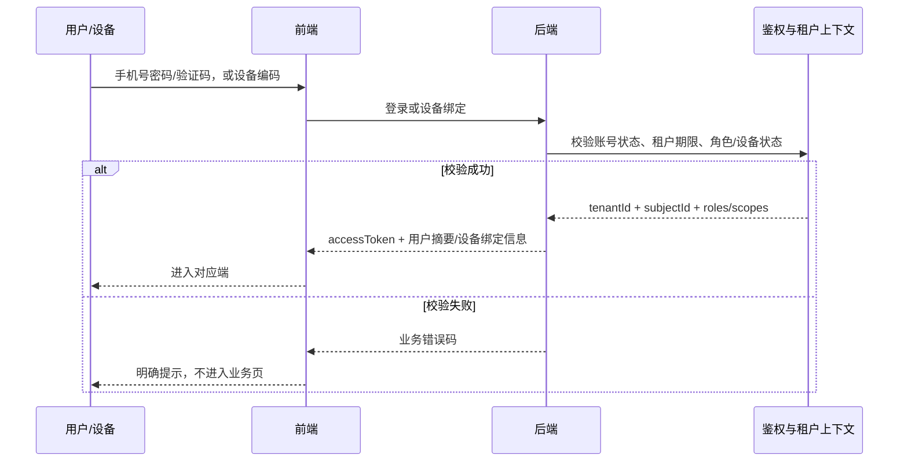
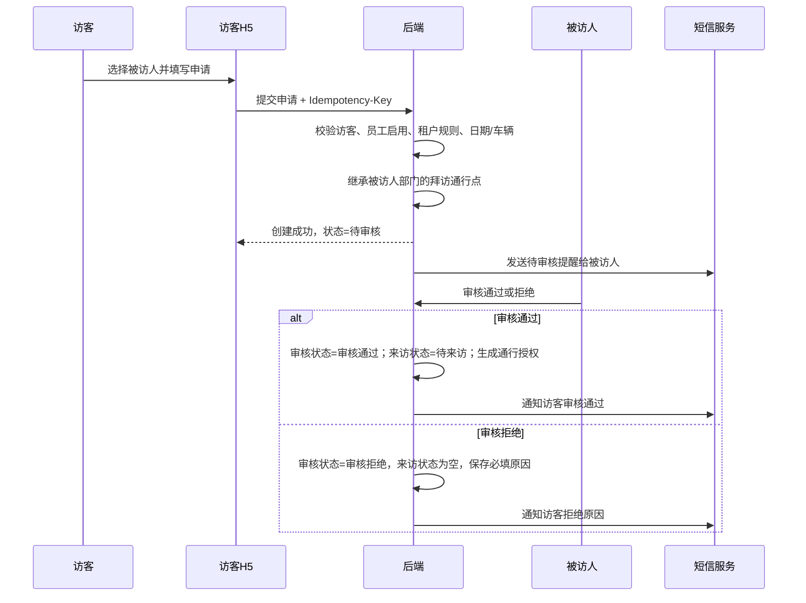
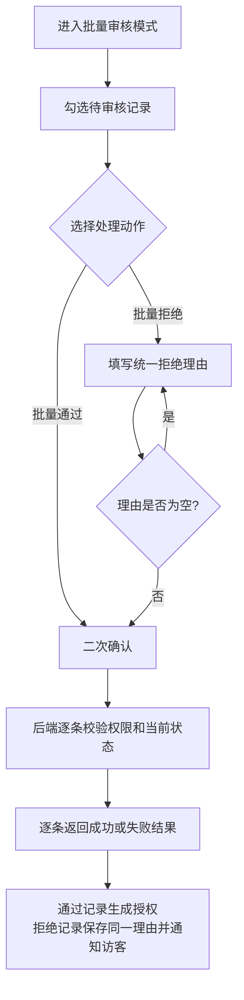
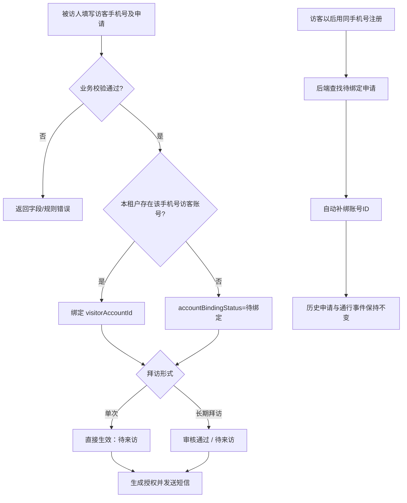
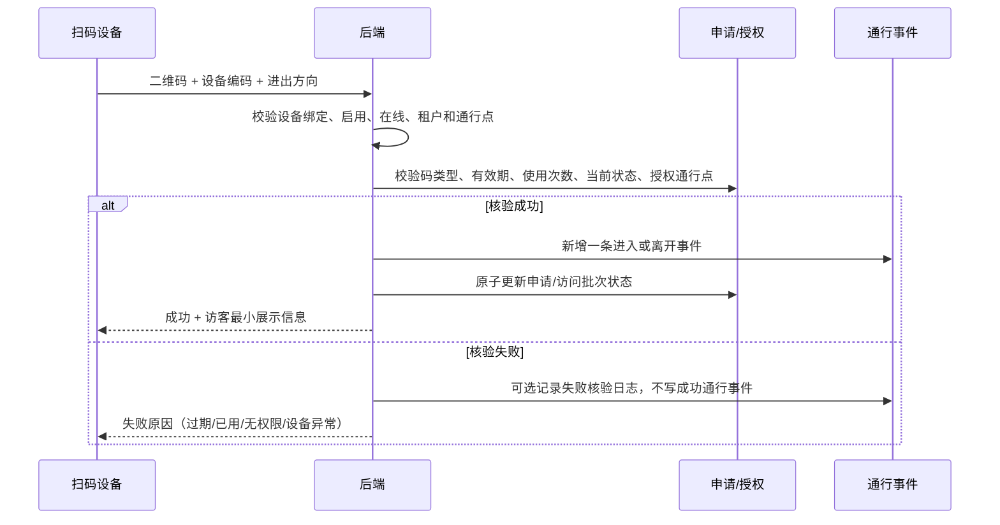
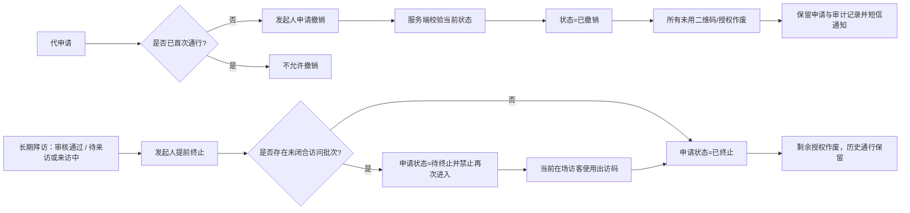
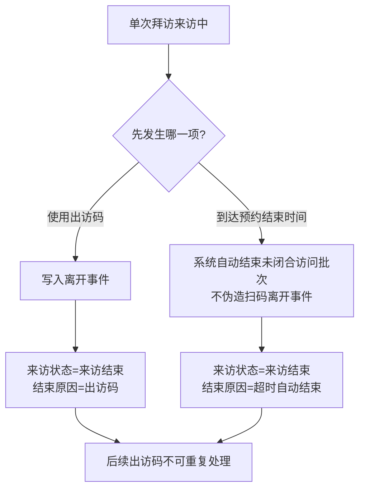

# 核心业务流程

## 1. 登录与租户隔离

## 2. 访客自主申请与审批

### 批量审核

同一次批量拒绝只接受一个拒绝理由，并应用于本次勾选的全部记录；不支持逐条填写不同理由。单条处理失败不得回滚其他已成功记录。

## 3. 被访人代申请与账号自动绑定

代申请无访客确认节点。首次通行前允许发起人撤销；长期拜访允许提前终止剩余授权。

## 4. 扫码进入与离开

## 5. 撤销与提前终止

## 6. 单次拜访结束

## 7. 短信结果边界

已确认规则：短信发送失败不得回滚已成功的申请、审核或通行业务；系统保留发送失败状态供后台追溯。异步方式、事务消息/Outbox、自动重试次数、服务商和人工补发均属于研发方案或待确认项，不在当前一期产品规则中指定。
