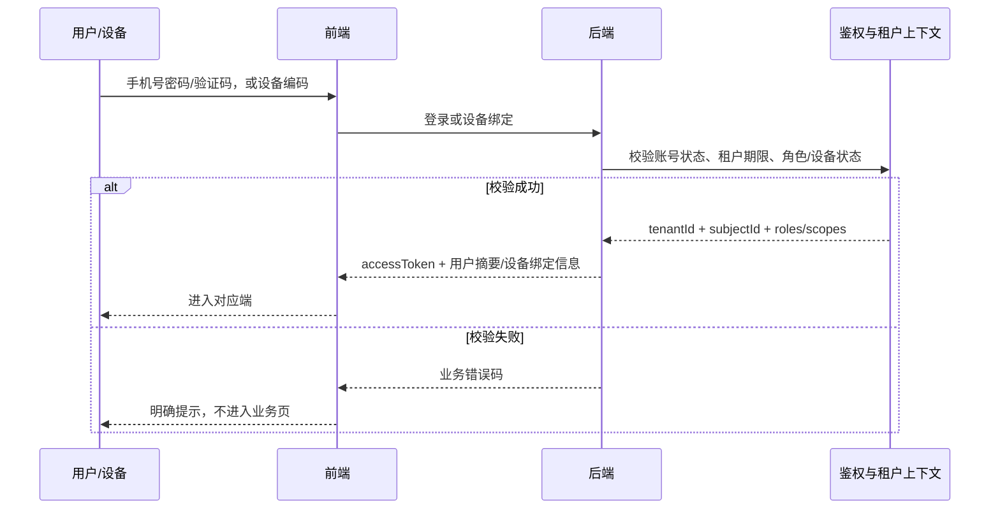
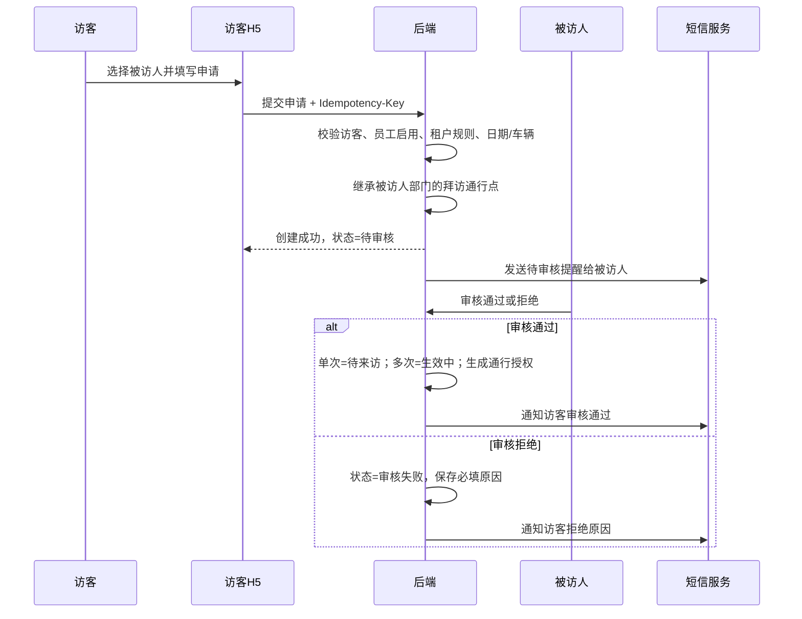
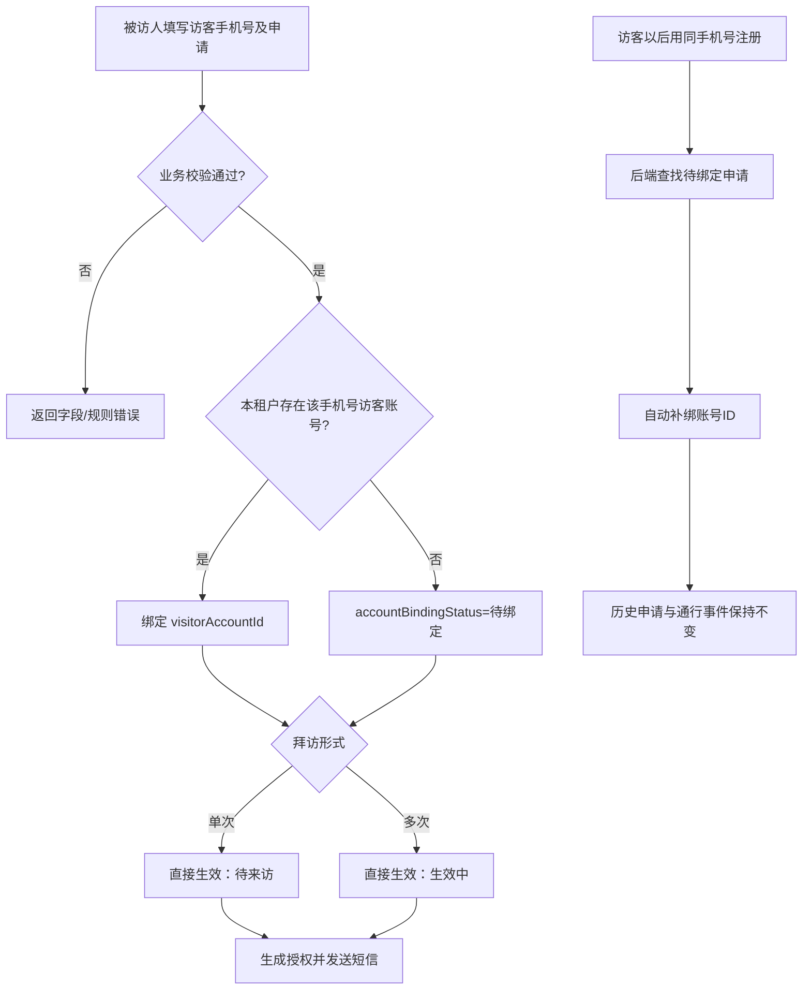
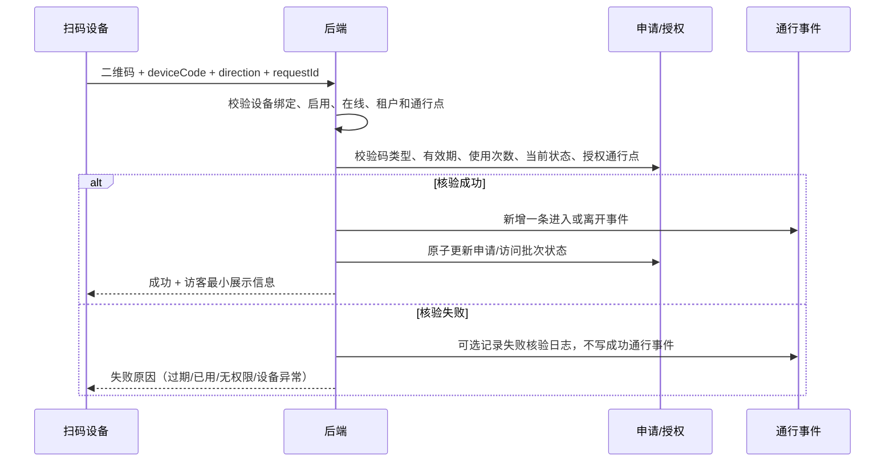
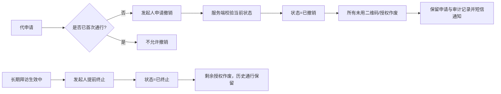

# 核心业务流程

## 1. 登录与租户隔离

## 2. 访客自主申请与审批

## 3. 被访人代申请与账号自动绑定

代申请无访客确认节点。首次通行前允许发起人撤销；长期拜访允许提前终止剩余授权。

## 4. 扫码进入与离开

## 5. 撤销与提前终止

## 6. 短信可靠性

业务事务先提交，短信采用事务消息/Outbox 异步发送。短信失败不得回滚已成功的申请或审核，只更新发送记录为失败并支持后台追溯；自动重试次数和服务商待评审确认。
