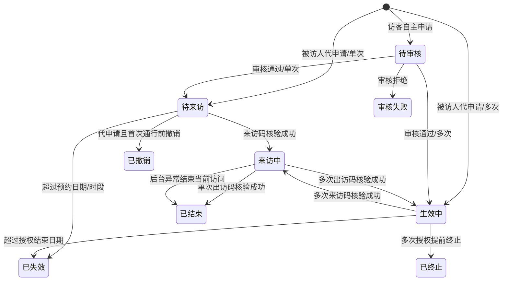
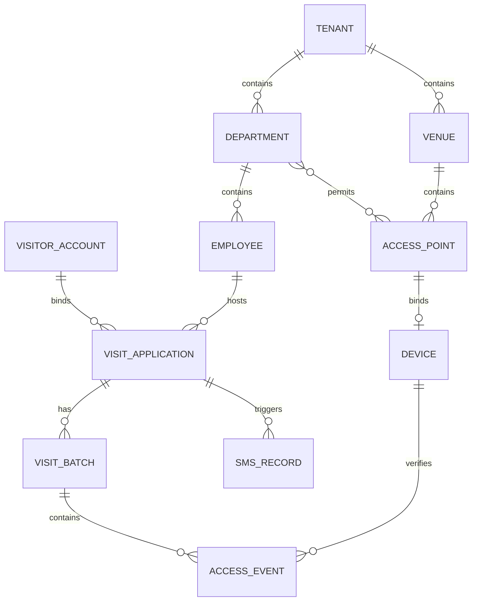

# 状态机与数据口径

## 1. 申请状态机

## 2. 建议状态枚举

| 服务端值 | 中文 | 适用 | 是否终态 | 前端语义色 |
|---|---|---|:---:|---|
| `PENDING_REVIEW` | 待审核 | 单次/多次 | 否 | 琥珀 |
| `PENDING_VISIT` | 待来访 | 单次 | 否 | 蓝 |
| `ACTIVE` | 生效中 | 多次 | 否 | 青蓝 |
| `VISITING` | 来访中 | 单次/当前批次 | 否 | 绿 |
| `COMPLETED` | 已结束 | 单次；或产品确认后的多次终态 | 是 | 紫 |
| `REJECTED` | 审核失败 | 单次/多次 | 是 | 红 |
| `EXPIRED` | 已失效 | 单次/多次 | 是 | 灰蓝 |
| `CANCELLED` | 已撤销 | 代申请 | 是 | 灰 |
| `TERMINATED` | 已终止 | 多次 | 是 | 深灰/红灰 |

前端不得根据日期自行永久改写状态，只可用于即时提示；最终状态及可执行动作由服务端返回。

## 3. 状态转换约束

| 动作 | 允许前置状态 | 后置状态 | 关键校验 |
|---|---|---|---|
| 审核通过（单次） | 待审核 | 待来访 | 审核人权限、被访人/通行点仍有效 |
| 审核通过（多次） | 待审核 | 生效中 | 同上 |
| 审核拒绝 | 待审核 | 审核失败 | 拒绝原因必填 |
| 扫码进入（单次） | 待来访 | 来访中 | 来访码未用、当日有效、设备/点位匹配 |
| 扫码离开（单次） | 来访中 | 已结束 | 出访码有效且当前存在未闭合批次 |
| 扫码进入（多次） | 生效中 | 来访中 | 有效期内且无未闭合批次 |
| 扫码离开（多次） | 来访中 | 生效中 | 关闭当前批次，申请授权继续有效 |
| 撤销 | 待来访/生效中 | 已撤销 | 仅代申请、首次通行前、操作者为发起人或授权后台人员 |
| 提前终止 | 生效中 | 已终止 | 长期拜访；保留历史事件 |
| 自动失效 | 待来访/生效中 | 已失效 | 由服务端定时任务或访问时惰性校验完成 |

并发审核、重复扫码、撤销与扫码竞态必须通过数据库条件更新或版本号保证只有一个转换成功；冲突统一返回 `STATE_CONFLICT`。

## 4. 核心数据关系

## 5. 必须统一的字段口径

| 字段 | 口径 |
|---|---|
| `tenantId` | 所有租户业务表必有；从鉴权上下文取值，不信任客户端传入 |
| `applicationId/applicationNo` | 内部主键/外显编号分离；通行事件必须关联申请 |
| `visitType` | `SINGLE` / `MULTIPLE` |
| `source` | `SELF` 自主申请 / `PROXY` 代申请 |
| `accountBindingStatus` | `BOUND` / `PENDING_BINDING` |
| `visitorAccountId` | 未注册代申请可为空，补绑后更新；不得据手机号直接覆盖历史归属 |
| `allowedAccessPointIds` | 申请创建时形成授权快照；部门以后改配置不应静默改变既有申请 |
| `direction` | `ENTRY` / `EXIT` |
| `verificationResult` | `SUCCESS` 或明确失败原因；成功事件不可重复写入 |
| `version` | 申请乐观锁版本，用于状态并发控制 |
| `createdBy/updatedBy` | 记录主体类型与 ID，满足审计追溯 |

## 6. 单次与多次时间口径

- 单次：`visitDate + startTime + endTime`，时区固定为 `Asia/Shanghai`；来访码、出访码当日各限成功一次。
- 多次：`validFrom + validTo + dailyStartTime + dailyEndTime`；有效期内可多次形成访问批次，每个批次最多一条成功进入和一条成功离开。
- 过期判断必须由服务端时间完成，接口返回 ISO 8601 时间和明确时区。
