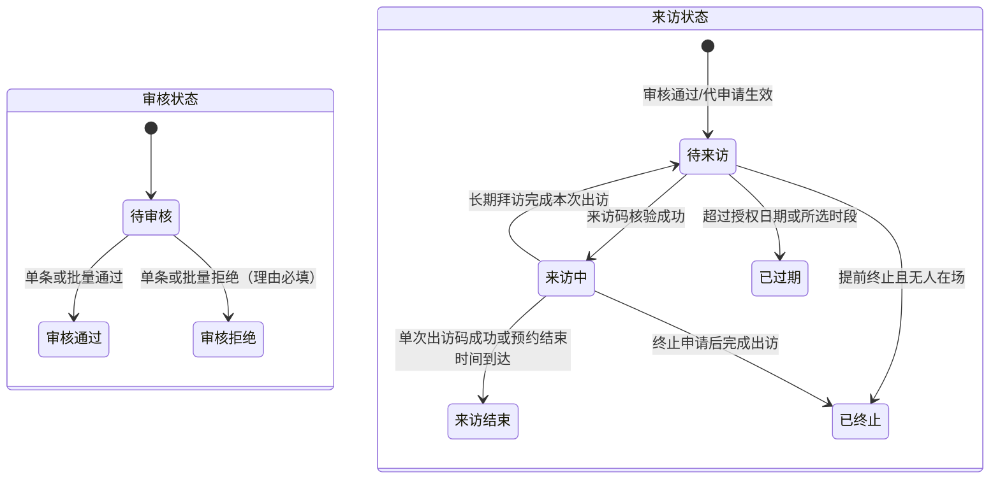
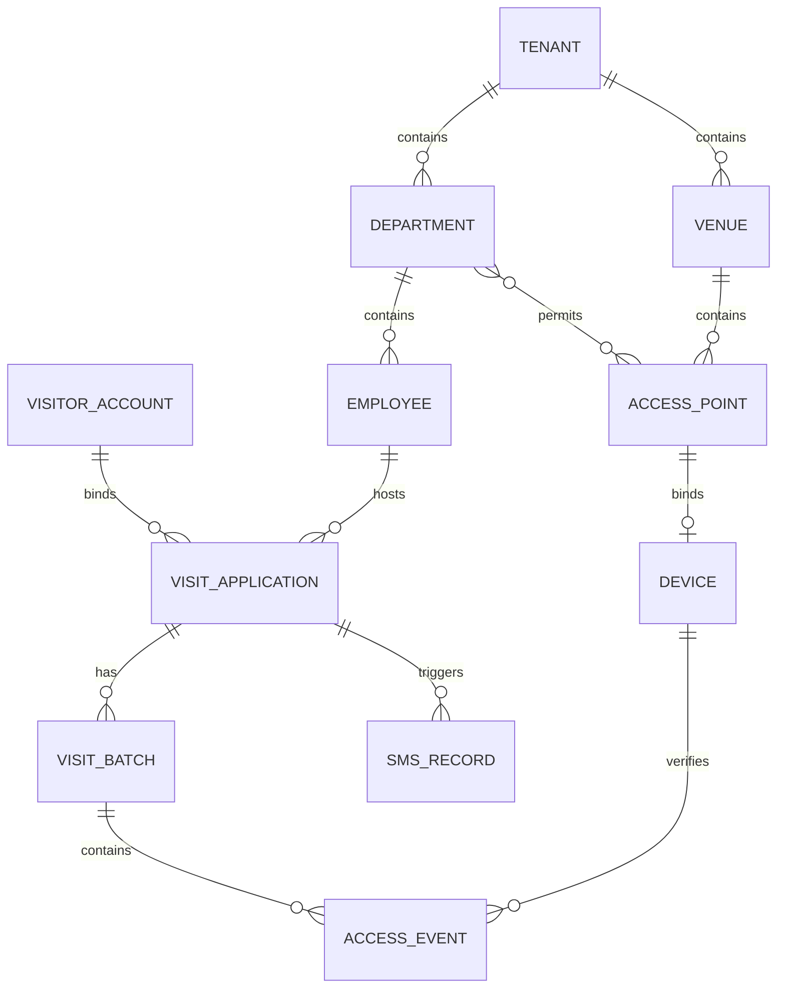

# 状态机与数据口径

> 2026-08-14 起申请状态拆分为审核状态与来访状态。本文与 `DEC-012` 为研发统一口径。

## 0. 双状态口径

| 状态域 | 枚举 | 说明 |
| --- | --- | --- |
| 审核状态 | `PENDING/待审核`、`APPROVED/审核通过`、`REJECTED/审核拒绝` | 只表达审批结论 |
| 来访状态 | `WAITING/待来访`、`VISITING/来访中`、`EXPIRED/已过期`、`FINISHED/来访结束`、`TERMINATED/已终止` | 审核通过后产生；待审核或审核拒绝时为空 |

- 长期拜访审核通过且当前无在场批次时为待来访；扫码进入为来访中；完成离开后恢复待来访；授权结束日期到达后为已过期。
- 单次拜访完成出访或预约结束时间自动结束后为来访结束，两种结束原因继续通过 `endReason` 区分。
- 前端只展示服务端返回的两个状态，不以本地时间永久改写。

## 1. 双状态状态机

审核拒绝时来访状态为空。长期拜访在授权期内按所选多个时段循环“待来访 → 来访中 → 待来访”；不再使用“生效中”作为来访状态。

## 2. 状态转换约束

| 动作 | 审核状态变化 | 来访状态变化 | 关键校验 |
|---|---|---|---|
| 审核通过 | 待审核 → 审核通过 | 空 → 待来访 | 审核权限、必填字段、时段与被访人仍有效 |
| 审核拒绝 | 待审核 → 审核拒绝 | 保持为空 | 拒绝理由必填 |
| 批量通过/拒绝 | 同上 | 同上 | 仅处理勾选记录；批量拒绝共用一个必填理由 |
| 扫码进入 | 不变 | 待来访 → 来访中 | 当前日期与所选时段有效，设备和点位匹配 |
| 单次扫码离开 | 不变 | 来访中 → 来访结束 | 出访码有效且存在未闭合批次 |
| 单次自动结束 | 不变 | 来访中 → 来访结束 | 到达预约结束时间；`endReason=TIMEOUT` |
| 长期扫码离开 | 不变 | 来访中 → 待来访 | 关闭本次批次，授权期内可再次来访 |
| 自动过期 | 不变 | 待来访 → 已过期 | 超过授权日期或全部可用时段 |
| 提前终止（无人在场） | 不变 | 待来访 → 已终止 | 剩余进入授权作废 |
| 提前终止（仍在场） | 不变 | 来访中保持至出访，出访后 → 已终止 | 立即禁止再次进入，保留当前出访权限 |

并发审核、重复扫码、单次自动结束与扫码出访竞态、终止与扫码竞态必须保证只有一个有效状态转换。具体并发实现和错误码由研发评审冻结。

## 4. 核心数据关系

## 5. 必须统一的字段口径

| 字段 | 口径 |
|---|---|
| `tenantId` | 所有租户业务表必有；从鉴权上下文取值，不信任客户端传入 |
| `applicationId/applicationNo` | 内部主键/外显编号分离；通行事件必须关联申请 |
| `visitType` | `SINGLE` / `MULTIPLE` |
| `source` | `SELF` 自主申请 / `PROXY` 代申请 |
| `accountBindingStatus` | `BOUND` / `PENDING_BINDING` |
| `visitorAccountId` | 未注册代申请可为空，补绑后更新；不得据手机号直接覆盖历史归属 |
| `allowedAccessPointIds` | 申请创建时形成授权快照；部门以后改配置不应静默改变既有申请 |
| `direction` | `ENTRY` / `EXIT` |
| `verificationResult` | `SUCCESS` 或明确失败原因；成功事件不可重复写入 |
| `endReason` | 单次或访问批次结束原因，至少区分 `EXIT_CODE`（出访码）、`TIMEOUT_AUTO_END`（超时自动结束）；其他取值待确认 |
| `version` | 申请乐观锁版本，用于状态并发控制 |
| `createdBy/updatedBy` | 记录主体类型与 ID，满足审计追溯 |

## 6. 单次与长期时间口径

- 单次：`visitDate + startTime + endTime`，时区固定为 `Asia/Shanghai`；来访码、出访码当日各限成功一次。来访中到达 `endTime` 后由服务端自动结束，结束原因记录为超时自动结束，但不生成虚假的扫码离开事件。
- 长期：`validFrom + validTo + dailyStartTime + dailyEndTime`；有效期内可重复形成访问批次，每个批次最多一条成功进入和一条成功离开。
- 过期判断必须由服务端时间完成，接口返回 ISO 8601 时间和明确时区。
