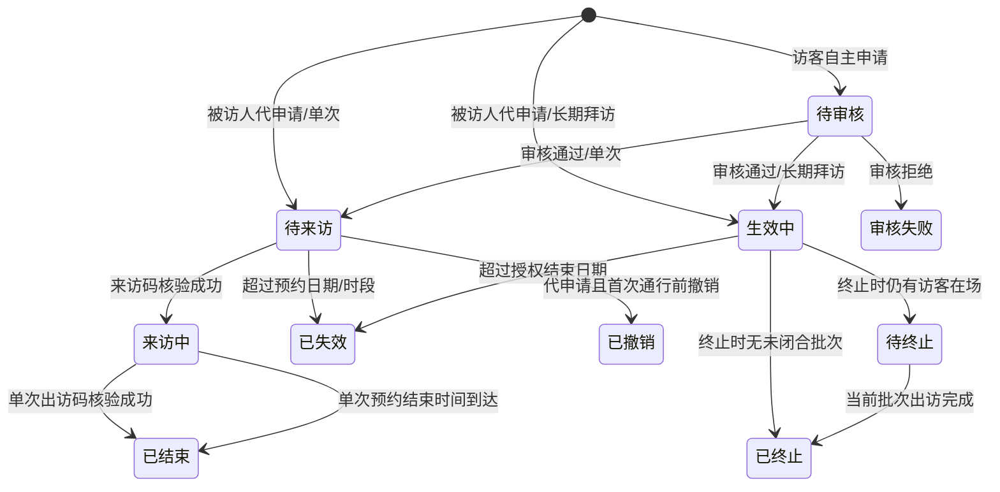
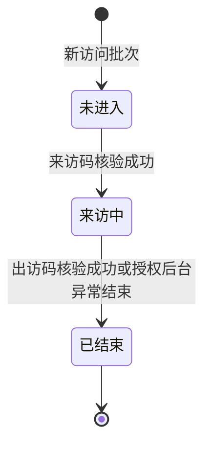
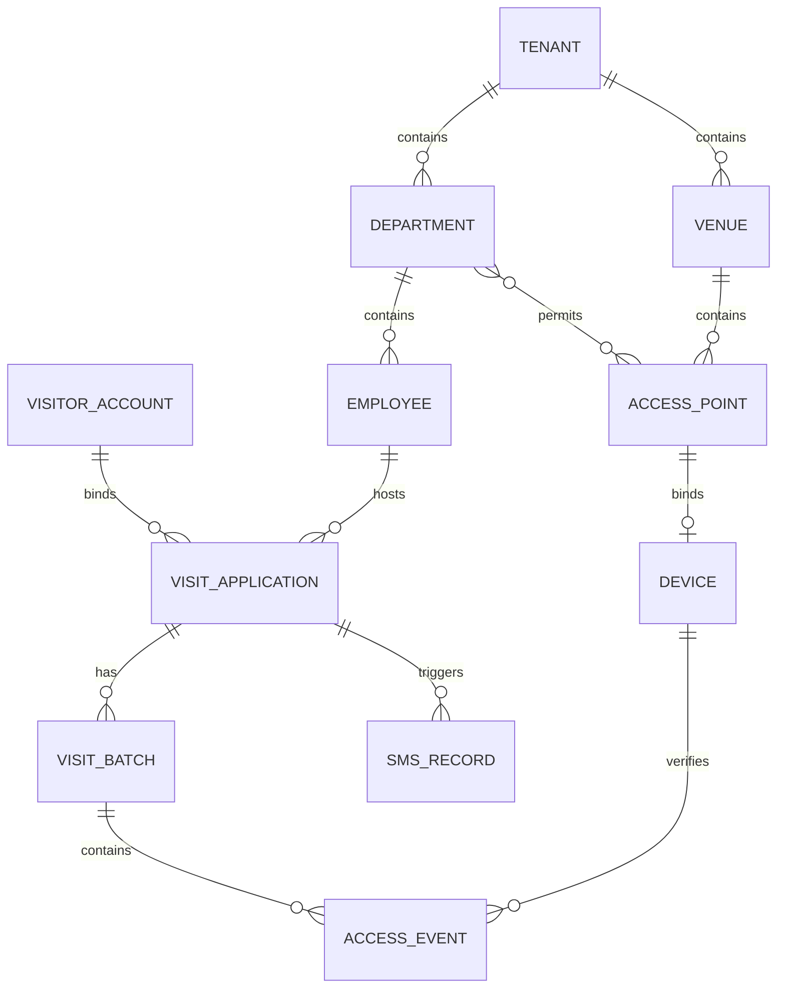

# 状态机与数据口径

## 1. 申请状态机

长期拜访的申请在有效期内保持 `ACTIVE/生效中`。其每次进入、离开由独立访问批次记录：

## 2. 建议状态枚举

| 服务端值 | 中文 | 适用 | 是否终态 | 前端语义色 |
|---|---|---|:---:|---|
| `PENDING_REVIEW` | 待审核 | 单次/长期 | 否 | 琥珀 |
| `PENDING_VISIT` | 待来访 | 单次 | 否 | 蓝 |
| `ACTIVE` | 生效中 | 长期 | 否 | 青蓝 |
| `VISITING` | 来访中 | 单次申请；长期仅用于访问批次 | 否 | 绿 |
| `COMPLETED` | 已结束 | 单次申请；长期仅用于访问批次 | 是 | 紫 |
| `REJECTED` | 审核失败 | 单次/长期 | 是 | 红 |
| `EXPIRED` | 已失效 | 单次/长期 | 是 | 灰蓝 |
| `CANCELLED` | 已撤销 | 代申请 | 是 | 灰 |
| `PENDING_TERMINATION` | 待终止 | 长期且仍有访客在场 | 否 | 橙灰 |
| `TERMINATED` | 已终止 | 长期 | 是 | 深灰/红灰 |

前端不得根据日期自行永久改写状态，只可用于即时提示；最终状态及可执行动作由服务端返回。

## 3. 状态转换约束

| 动作 | 允许前置状态 | 后置状态 | 关键校验 |
|---|---|---|---|
| 审核通过（单次） | 待审核 | 待来访 | 审核人权限、被访人/通行点仍有效 |
| 审核通过（长期） | 待审核 | 生效中 | 同上 |
| 审核拒绝 | 待审核 | 审核失败 | 拒绝原因必填 |
| 批量审核通过 | 待审核 | 单次=待来访；长期=生效中 | 仅处理勾选记录，服务端逐条校验权限和当前状态 |
| 批量审核拒绝 | 待审核 | 审核失败 | 本批次统一拒绝理由必填并保存至每条成功处理记录 |
| 扫码进入（单次） | 待来访 | 来访中 | 来访码未用、当日有效、设备/点位匹配 |
| 扫码离开（单次） | 来访中 | 已结束 | 出访码有效且当前存在未闭合批次 |
| 自动结束（单次） | 来访中 | 已结束 | 服务端时间到达预约结束时间；记录结束原因为超时自动结束，不伪造扫码离开事件 |
| 扫码进入（长期） | 申请=生效中；批次=未进入 | 申请=生效中；批次=来访中 | 有效期内且无未闭合批次 |
| 扫码离开（长期） | 申请=生效中；批次=来访中 | 申请=生效中；批次=已结束 | 关闭当前批次，申请授权继续有效 |
| 撤销 | 待来访/生效中 | 已撤销 | 仅代申请、首次通行前、操作者为发起人或授权后台人员 |
| 提前终止（无人在场） | 生效中 | 已终止 | 长期拜访且无未闭合批次；剩余进入授权作废 |
| 申请终止（仍在场） | 生效中 | 待终止 | 长期拜访且存在未闭合批次；拒绝新的进入，保留当前出访权限 |
| 待终止出访 | 申请=待终止；批次=来访中 | 申请=已终止；批次=已结束 | 当前在场访客出访成功后终止生效 |
| 自动失效 | 待来访/生效中 | 已失效 | 由服务端定时任务或访问时惰性校验完成 |

并发审核、重复扫码、单次自动结束与扫码出访竞态、终止与扫码竞态必须保证只有一个有效状态转换。具体并发实现和错误码由研发评审冻结。

## 4. 核心数据关系

## 5. 必须统一的字段口径

| 字段 | 口径 |
|---|---|
| `tenantId` | 所有租户业务表必有；从鉴权上下文取值，不信任客户端传入 |
| `applicationId/applicationNo` | 内部主键/外显编号分离；通行事件必须关联申请 |
| `visitType` | `SINGLE` / `MULTIPLE` |
| `source` | `SELF` 自主申请 / `PROXY` 代申请 |
| `accountBindingStatus` | `BOUND` / `PENDING_BINDING` |
| `visitorAccountId` | 未注册代申请可为空，补绑后更新；不得据手机号直接覆盖历史归属 |
| `allowedAccessPointIds` | 申请创建时形成授权快照；部门以后改配置不应静默改变既有申请 |
| `direction` | `ENTRY` / `EXIT` |
| `verificationResult` | `SUCCESS` 或明确失败原因；成功事件不可重复写入 |
| `endReason` | 单次或访问批次结束原因，至少区分 `EXIT_CODE`（出访码）、`TIMEOUT_AUTO_END`（超时自动结束）；其他取值待确认 |
| `version` | 申请乐观锁版本，用于状态并发控制 |
| `createdBy/updatedBy` | 记录主体类型与 ID，满足审计追溯 |

## 6. 单次与长期时间口径

- 单次：`visitDate + startTime + endTime`，时区固定为 `Asia/Shanghai`；来访码、出访码当日各限成功一次。来访中到达 `endTime` 后由服务端自动结束，结束原因记录为超时自动结束，但不生成虚假的扫码离开事件。
- 长期：`validFrom + validTo + dailyStartTime + dailyEndTime`；有效期内可重复形成访问批次，每个批次最多一条成功进入和一条成功离开。
- 过期判断必须由服务端时间完成，接口返回 ISO 8601 时间和明确时区。
