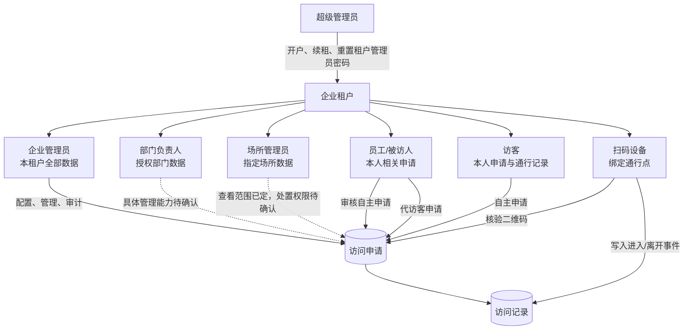
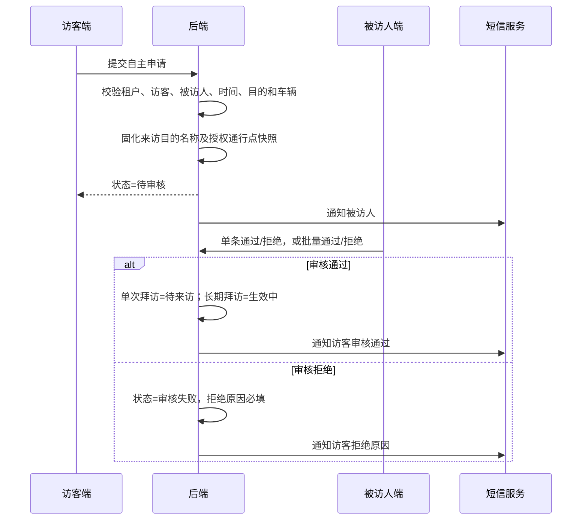
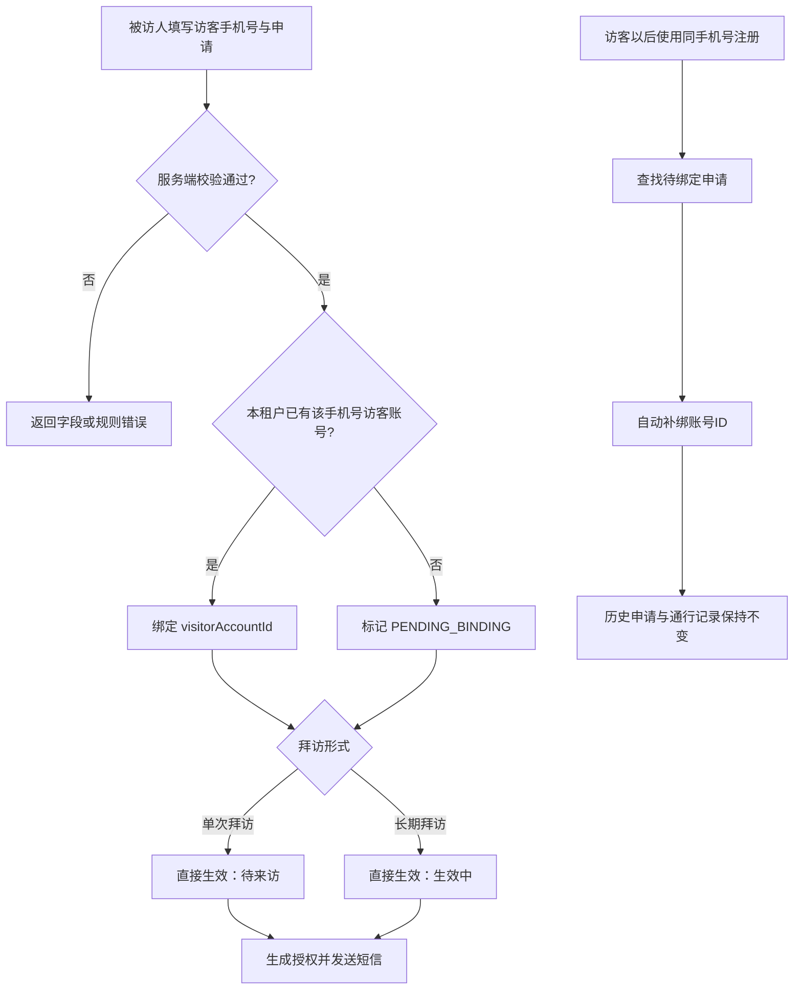
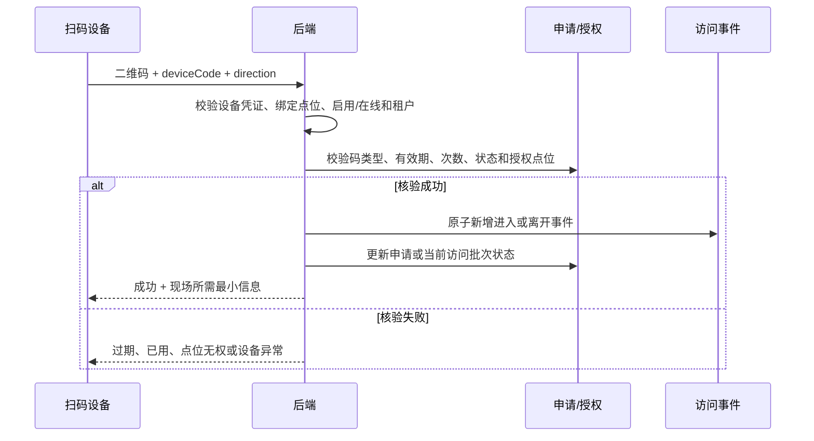
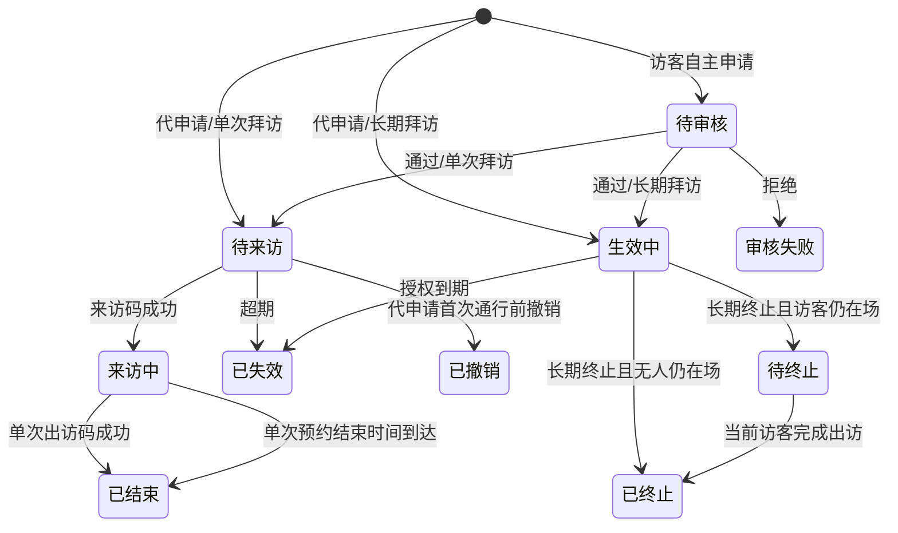
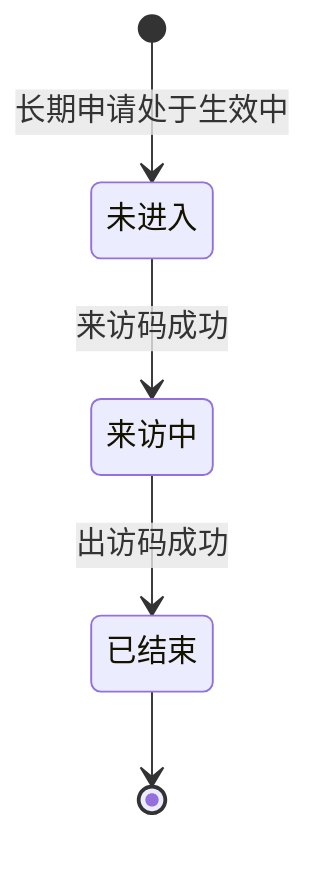

# 访客系统一期·前后端研发交付简版

版本：V0.2（评审稿）

基线：线上提交 `1537967`

用途：前端、后端首次对接和规则评审的首读文件。

> 本文只保留必须统一的角色、流程、状态和接口边界。详细字段、错误码及验收项见 [`docs/integration/README.md`](./integration/README.md)。

## 1. 角色与权限图

角色约束：

- 员工/被访人与访客身份互斥。
- 一期没有门卫人员账号；扫码端以设备编码和绑定通行点鉴权。
- 所有列表、详情、导出和写操作都由后端重复校验租户和数据范围，不能只依赖前端隐藏按钮。

| 角色 | 核心权限 | 数据范围 |
|---|---|---|
| 超级管理员 | 租户开户、编辑、续租、管理员重置密码 | 平台租户资料 |
| 企业管理员 | 企业配置、组织、账号、场所、员工、申请和记录管理 | 当前租户全部 |
| 部门负责人 | 具体读写能力待确认 | 授权部门；是否含下级部门待确认 |
| 场所管理员 | 场所相关查看；审核、代申请等写权限待确认 | 指定场所 |
| 被访人 | 审核本人申请、代申请、查看本人相关记录 | 本人相关 |
| 访客 | 自主申请、查看申请/二维码/通行记录 | 本人账号 |
| 扫码设备 | 核验来访码/出访码并写入事件 | 绑定通行点 |

## 2. 自主申请与审批流程

批量审核支持“批量通过”和“批量拒绝”。交互固定为：进入多选模式 → 勾选待审核记录 → 选择通过或拒绝 → 二次确认 → 后端逐条处理并返回逐条结果。选择批量拒绝时必须填写一个统一拒绝理由，该理由应用于本次勾选的全部记录；同一批次不支持分别填写理由。某条失败不得回滚或重复处理其他已成功记录。

## 3. 代申请与账号补绑流程

关键规则：一期代申请免审且没有“等待访客确认”；首次通行前可由发起人或已授权后台人员撤销，长期拜访可提前终止剩余授权。终止时若访客仍在场，申请先进入待终止并禁止再次进入，访客完成出访后再转为已终止。历史申请和通行记录保留。租户二次审批不纳入当前一期实现。

## 4. 扫码进入与离开流程

一个申请可关联多条访问事件；访问记录中的每次进入、离开必须独立保存，不能覆盖申请记录。

## 5. 申请与访问批次状态

长期拜访必须区分“申请授权状态”和“单次访问批次状态”：扫码进入、离开只改变当前访问批次，不把长期申请整体改为“来访中”。

状态由后端决定。前端只根据接口返回状态展示标签和可用操作，不根据本地时间永久改写状态。

## 6. 前后端责任边界

| 前端负责 | 后端负责 |
|---|---|
| 按角色展示页面、按钮和默认筛选 | 鉴权、租户隔离、权限点和数据范围 |
| 表单基础校验与明确错误提示 | 业务规则最终校验和字段快照 |
| 申请/访问列表、详情、状态和空态 | 状态机、权限校验和审计追溯；并发与幂等方案由研发确认 |
| 批量审核多选、通过/拒绝选择、统一拒绝理由与二次确认 | 批量逐条校验、保存统一拒绝理由、逐条结果和冲突处理 |
| 展示二维码及设备核验结果 | 签发二维码、设备鉴权和原子写通行事件 |
| 根据配置展示来访目的和动态字段 | 维护配置、保留历史名称快照 |
| 展示短信状态 | 发送失败不回滚业务，并保留可追溯的失败记录；重试策略待确认 |

## 7. 一期场景闭环清单

| 场景 | 已确认结果 | 主要异常/边界 |
|---|---|---|
| 租户开户与登录 | 超管创建唯一租户管理员；访客固定支持密码/验证码；被访人登录方式由开户配置决定 | 租户到期限制后台登录；员工禁用后不可登录 |
| 自主申请 | 选择启用被访人，继承其部门通行点，进入待审核 | “其他”目的必须补充；拒绝原因必填 |
| 代申请与补绑 | 一期免审并直接生效；按本租户手机号绑定，注册后自动补绑 | 不出现访客确认；历史归属不随补绑改变 |
| 批量审核 | 支持批量通过和批量拒绝；拒绝时统一理由必填 | 同一批次不能逐条填写不同理由；单条失败不影响其他成功记录 |
| 单次通行 | 使用出访码后正常结束；未出访时在预约结束时间到达后自动结束 | 自动结束需记录结束原因且不伪造扫码离开事件；重复、过期、错点位、设备禁用或离线均拒绝 |
| 长期通行 | 申请保持生效中；每次进入/离开形成独立访问批次 | 到期已失效；终止后禁止新进入 |
| 撤销与终止 | 首次通行前可撤销代申请；长期授权无人仍在场时立即终止，在场时先待终止并于出访后生效 | 待终止期间只允许当前在场访客出访；历史申请和通行记录保留 |
| 来访目的配置 | 租户可增改、启停和删除；历史保存名称快照 | 停用项不可用于新申请；“其他”不可删除 |
| 手机号换绑 | 身份编号和历史记录保持不变 | 原手机号验证码校验；不得新建历史归属 |
| 短信通知 | 审批、结果、到访等消息形成发送记录 | 发送失败不回滚业务；重试策略待确认 |

## 8. 接口范围与属性

- 鉴权：验证码、登录、当前用户、手机号换绑；令牌刷新机制由研发确认。
- 配置：公开拜访配置、被访人搜索、来访目的管理。
- 申请：自主申请、代申请、列表、详情、单条/批量审核、撤销、终止、二维码。
- 通行：设备绑定、二维码核验、访问事件列表与详情；设备心跳是否单独设接口由研发确认。
- 后台：组织、账号、员工、场所、通行点、设备和短信记录。

已确认产品约束：租户业务必须隔离；服务端必须校验角色、数据范围和当前业务状态。

研发建议（不是已冻结产品规则）：写操作幂等、并发状态控制、列表分页、统一错误码和 `requestId`。HTTP 状态码、令牌刷新、乐观锁、设备心跳、二维码签名/刷新、短信 Outbox 与重试方案，均由前后端及运维评审后写入正式 OpenAPI 和技术设计。

## 9. 联调前必须冻结

1. 部门负责人是否包含下级部门。
2. 场所管理员是否拥有审核和代申请权限。
3. 二维码有效期、刷新方式和设备离线策略。
4. 短信是否自动重试，以及是否提供人工补发。
5. 来访目的是否允许重名及展示排序规则。

## 10. 边界声明

- 当前交付基于一期范围、已生效决策和提交 `1537967` 的原型；它是联调评审稿，不替代正式 OpenAPI、数据库设计和测试用例。
- 租户代申请二次审批、二维码离线核验、短信自动重试和人工补发均未被当前项目确认，不得默认纳入一期。
- 文中标为“研发建议”或“待确认”的内容，评审冻结前不得当作产品既定要求。

详细接口和验收清单：

- [接口契约建议稿](./integration/04-接口契约建议稿.md)
- [联调计划与验收清单](./integration/05-联调计划与验收清单.md)
